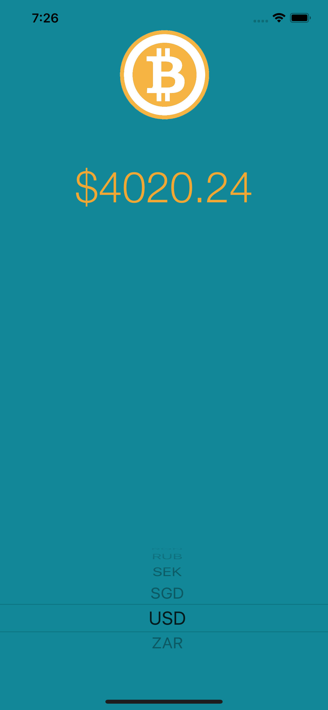

#  Bitcoin Ticker

## Goal

We are going to revisit how to use Cocoapods, networking calls and JSON parsing.

## What is created

We’re going to make a Bitcoin price ticker. The app will give you the latest Bitcoin prices in all the popular, traded currencies, so you can track how well your Bitcoin investments are doing on the go.

## Final App

